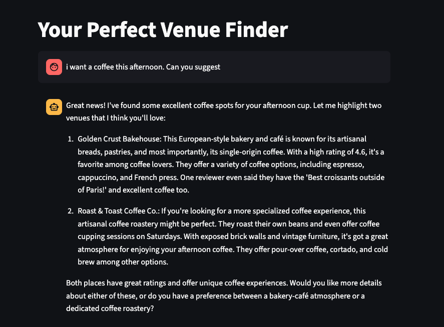

# Your Perfect Venue Finder

A conversational AI-powered app to help users find the perfect venue for any occasion, using natural language and smart recommendations.

## Features

- **Conversational Search:** Users interact with a chat interface to describe their ideal venue, occasion, or preferences.
- **AI-Powered Intent Recognition:** The app uses Anthropic’s Claude model to classify user intent and extract venue preferences.
- **Smart Venue Scoring:** Venues are scored and ranked based on how well they match the user’s intent, including type, food, drinks, rating, and more.
- **Rich Venue Data:** Recommendations are based on a curated list of venues, each with detailed descriptions, menus, reviews, and locations.

## Demo



## Getting Started

### Prerequisites

- Python 3.8+
- [Streamlit](https://streamlit.io/)
- [Anthropic API key](https://docs.anthropic.com/claude/docs/quickstart-guide)
- [dotenv](https://pypi.org/project/python-dotenv/)

### Installation

1. **Clone the repository:**
   ```bash
   git clone <your-repo-url>
   cd venue-selection
   ```

2. **Install dependencies:**
   ```bash
   pip install -r requirements.txt
   ```

3. **Set up your environment variables:**
   - Create a `.env` file in the root directory.
   - Add your Anthropic API key:
     ```
     ANTHROPIC_API_KEY=your_api_key_here
     ```

4. **Run the app:**
   ```bash
   streamlit run app.py
   ```

## Project Structure

```
.
├── app.py                  # Main Streamlit app
├── requirements.txt        # Python dependencies
├── data/
│   └── venues_list.json    # Venue data (sample venues)
├── src/
│   ├── classify_user_intent.py      # Classifies user intent from chat
│   ├── data_objects.py              # Data models for venues and user intents
│   ├── process_user_conversation.py # Handles venue-related chat logic
│   └── score_venues_with_ai.py      # Scores and ranks venues
└── ...
```

## Data Format

Sample entry from `data/venues_list.json`:
```json
{
  "type_of_place": ["cocktail_bar"],
  "name": "The Gilded Falcon",
  "description": "An upscale cocktail lounge featuring craft cocktails in an Art Deco setting...",
  "meal": ["Oysters - $18", "Charcuterie Board - $24"],
  "meal_types": ["appetizer", "main course", "dessert"],
  "drinks": ["Old Fashioned - $16", "Negroni - $14"],
  "drink_types": ["cocktail", "wine", "beer"],
  "rating": 4.7,
  "reviews": [
    {"text": "Incredible atmosphere...", "stars_number": 5.0}
  ],
  "location": [40.7549, -73.9840]
}
```

## How it Works

1. **User Interaction:** The user chats with the app, describing their needs.
2. **Intent Classification:** The app uses AI to extract structured intent (venue type, food, drinks, rating, etc.).
3. **Venue Scoring:** Venues are scored and ranked based on how well they match the user’s intent.
4. **Conversational Recommendations:** The app responds with tailored venue suggestions and can answer follow-up questions.

## Customization

- Add or edit venues in `data/venues_list.json`.
- Adjust scoring logic in `src/score_venues_with_ai.py`.
- Modify prompts and conversation logic in the `src/prompts/` directory.

## Dependencies

- streamlit
- anthropic
- dotenv

## License

[MIT](LICENSE) (or your preferred license)
